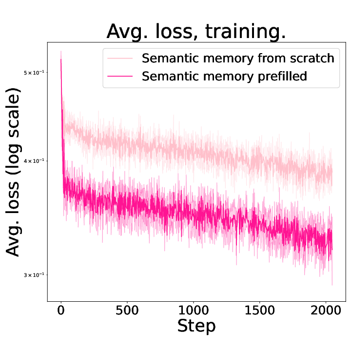
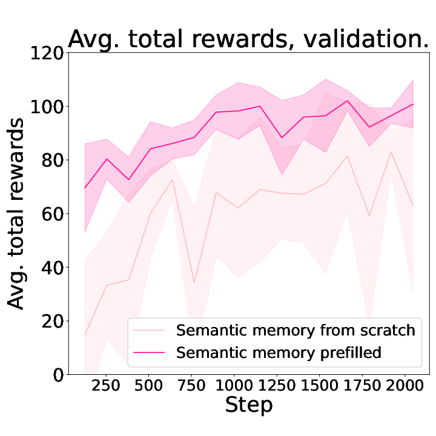
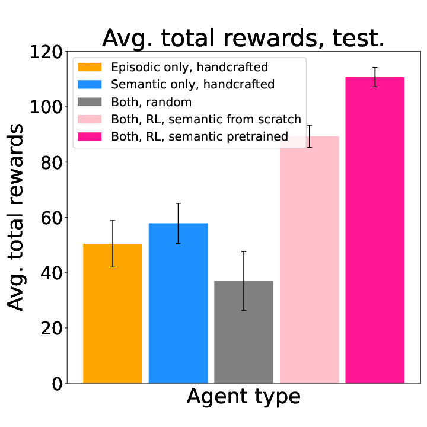
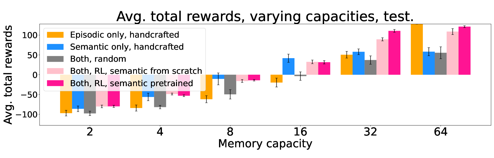

# explicit-memory

For the documentation of [the older paper](https://arxiv.org/abs/2204.01611), check out
[this documentation](./v0/README-v0.md)

This repo is to train an agent that interacts with the [RoomEnv-v1](https://github.com/tae898/room-env).
See the [paper](https://arxiv.org/abs/2212.02098) for more information.

## Prerequisites

1. A unix or unix-like x86 machine
1. python 3.8 or higher.
1. Running in a virtual environment (e.g., conda, virtualenv, etc.) is highly recommended so that you don't mess up with the system python.
1. `pip install -r requirements.txt`

## Training

```python
python train.py --config train.yaml
```

The hyperparameters can be configured in `train.yaml`. The training results with the
checkpoints will be saved at `./training_results/`

## Results

|                 Average loss, training.                 |           Average total rewards per episode, validation.           |              Average total rewards per episode, test.               |           Average total rewards, varying capacities, test.           |
| :-----------------------------------------------------: | :----------------------------------------------------------------: | :-----------------------------------------------------------------: | :------------------------------------------------------------------: |
|  |  |  |  |

There is one different thing in the RoomEnv from the original AAAI-2023 paper: The reward is either +1 or -1, instead of +1 or 0.

Also check out [`./models/`](./models) to see the saved training results. The `test_debug`
results might especially be interesting to you.

## Contributing

Contributions are what make the open source community such an amazing place to be learn, inspire, and create. Any contributions you make are **greatly appreciated**.

1. Fork the Project
1. Create your Feature Branch (`git checkout -b feature/AmazingFeature`)
1. Run `make test && make style && make quality` in the root repo directory, to ensure code quality.
1. Commit your Changes (`git commit -m 'Add some AmazingFeature'`)
1. Push to the Branch (`git push origin feature/AmazingFeature`)
1. Open a Pull Request

## [Cite our paper](https://arxiv.org/abs/2212.02098)

```bibtex
@misc{https://doi.org/10.48550/arxiv.2212.02098,
  doi = {10.48550/ARXIV.2212.02098},
  url = {https://arxiv.org/abs/2212.02098},
  author = {Kim, Taewoon and Cochez, Michael and François-Lavet, Vincent and Neerincx, Mark and Vossen, Piek},
  keywords = {Artificial Intelligence (cs.AI), FOS: Computer and information sciences, FOS: Computer and information sciences},
  title = {A Machine with Short-Term, Episodic, and Semantic Memory Systems},
  publisher = {arXiv},
  year = {2022},
  copyright = {Creative Commons Attribution 4.0 International}
}
```

## Cite our code

[](https://zenodo.org/badge/latestdoi/411241603)

## Authors

- [Taewoon Kim](https://taewoon.kim/)
- [Michael Cochez](https://www.cochez.nl/)
- [Vincent Francois-Lavet](http://vincent.francois-l.be/)
- [Mark Neerincx](https://ocw.tudelft.nl/teachers/m_a_neerincx/)
- [Piek Vossen](https://vossen.info/)

## License

[MIT](https://choosealicense.com/licenses/mit/)
